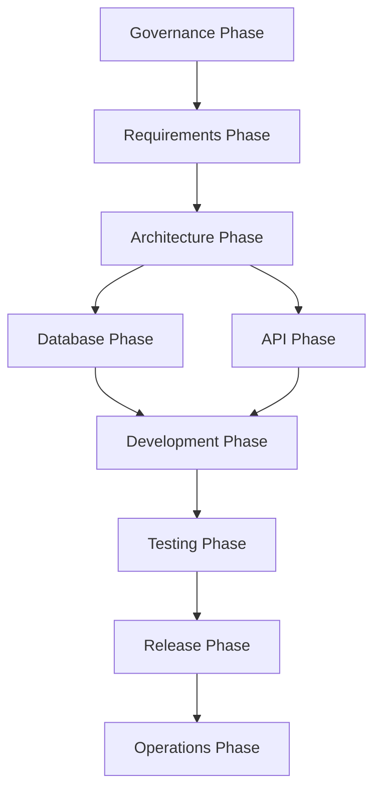
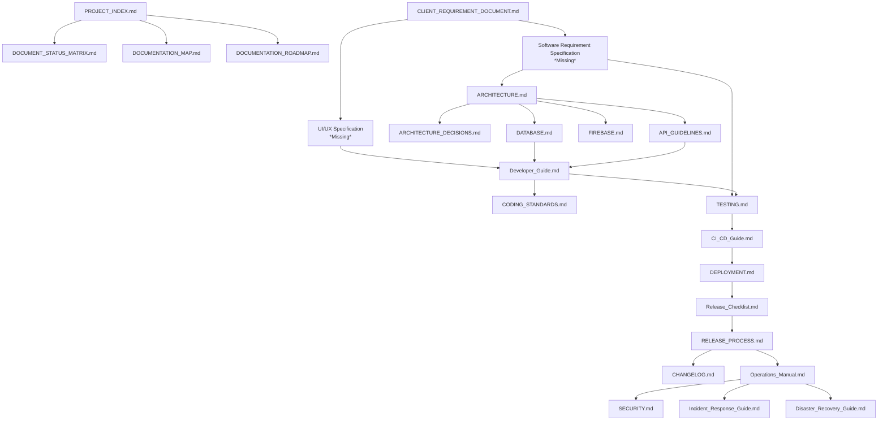

# Documentation Map

**Purpose**: Visualizes the relationships, flow, and dependencies between all repository documents.

## High Level Documentation Flow

## Detailed Document Dependencies

### Dependency Explanations

1. **Governance drives everything**: The `PROJECT_INDEX.md` is the starting point that links to matrices and roadmaps.
2. **Requirements define Architecture**: The `CLIENT_REQUIREMENT_DOCUMENT.md` must be expanded into an `SRS` before `ARCHITECTURE.md` can be finalized.
3. **Architecture dictates Data & API**: The `ARCHITECTURE.md` acts as a foundation for `DATABASE.md` and `API_GUIDELINES.md`.
4. **Development relies on Specs**: Developers use the `Developer_Guide.md` and `CODING_STANDARDS.md`, but their implementation targets are defined by UI/UX specs and DB/API contracts.
5. **Testing verifies Requirements**: `TESTING.md` derives its test cases directly from the `SRS`.
6. **Release process**: A rigorous path from `TESTING.md` -> `CI_CD_Guide.md` -> `DEPLOYMENT.md` -> `Release_Checklist.md` ensures quality.
7. **Maintenance**: Operational documents (`Operations_Manual.md`, `Disaster_Recovery_Guide.md`) take over post-release.
