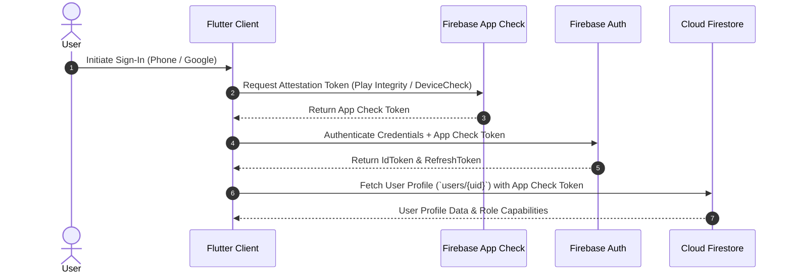
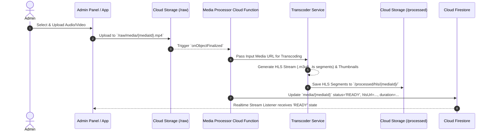

# Architecture Documentation

## System Overview

Santmat Satsang Prachar is a cross-platform mobile and web ecosystem designed for distributing spiritual satsang audio, videos, books, events, and community updates. The application architecture follows **Clean Architecture** and a **Feature-First** structure in Flutter, backed by a production-ready **Firebase Serverless Backend**, Cloud Functions, Cloud Storage, dynamic CDN caching, and custom Media Processing pipelines.

```
+-----------------------------------------------------------------------+
|                           FLUTTER CLIENT                              |
|  +-------------------+  +-------------------+  +-------------------+  |
|  | Presentation Layer|  |   Domain Layer    |  |    Data Layer     |  |
|  | (UI & Riverpod)   |->| (Use Cases/Models)|->| (Repos & Sources) |  |
|  +-------------------+  +-------------------+  +-------------------+  |
+-----------------------------------:-----------------------------------+
                                    | HTTPS / GRPC (App Check Verified)
                                    v
+-----------------------------------------------------------------------+
|                          FIREBASE PLATFORM                            |
|  +-------------------+  +-------------------+  +-------------------+  |
|  | Firebase Auth     |  | Cloud Firestore   |  | Cloud Storage     |  |
|  | (Phone, Google)   |  | (NoSQL Database)  |  | (HLS, PDF, Audio) |  |
|  +-------------------+  +-------------------+  +-------------------+  |
+-----------------------------------:-----------------------------------+
                                    | Cloud Triggers & HTTPS
                                    v
+-----------------------------------------------------------------------+
|                         BACKEND SERVICES                              |
|  +-------------------+  +-------------------+  +-------------------+  |
|  | Cloud Functions   |  | Media Processing  |  | CDN & Cache Layer |  |
|  | (Node.js/TS)      |  | (FFmpeg / HLS)    |  | (Firebase Hosting)|  |
|  +-------------------+  +-------------------+  +-------------------+  |
+-----------------------------------------------------------------------+
```

---

## Technical Stack & Architectural Layers

### Mobile App Architecture (Flutter)
- **State Management**: [Riverpod 2.x / 3.x](file:///Users/jaymac/Documents/Santmat-Satsang-Prachar/mobile/app/lib) with `NotifierProvider` and `AsyncNotifierProvider`.
- **Routing**: `GoRouter` with auth-guard redirection and deep link parsing.
- **Local Persistence**: `Hive` for offline-first caching of user preferences, media metadata, and playback positions.
- **Networking**: `Dio` with custom retry interceptors and auth token refreshes.
- **Layers**:
  - `presentation/`: UI Screens, Widgets, Riverpod Controllers.
  - `domain/`: Entities, Value Objects, Repository Interfaces, Use Cases.
  - `data/`: DTOs, Repository Implementations, Remote Data Sources (Firestore/Firebase Storage), Local Data Sources (Hive).

### Backend & Cloud Architecture
- **Authentication**: Firebase Authentication with Multi-Factor Authentication (MFA), Phone OTP, and Google Sign-In.
- **Database**: Cloud Firestore with multi-region replication, indexes, and strict Security Rules.
- **Storage**: Firebase Storage bucket partitioned into `/raw`, `/processed`, `/public`, and `/user_uploads`.
- **Serverless Compute**: Cloud Functions v2 (TypeScript) handling triggers for user creation, media encoding, analytics aggregation, and push notifications via FCM.

---

## Sequence Diagrams

### 1. User Authentication & App Check Flow



### 2. Media Upload & Processing Pipeline



---

## Security Architecture

- **App Check**: Enforced across Firestore, Storage, and Cloud Functions to restrict access strictly to genuine app instances.
- **Role-Based Access Control (RBAC)**: Custom Claims attached to Firebase Auth ID tokens (`admin`, `editor`, `listener`).
- **Data Encryption**:
  - In Transit: TLS 1.3 enforced across all endpoints.
  - At Rest: AES-256 transparent encryption on Firestore and Cloud Storage.

---

## Extensibility & Reliability Standards

1. **Idempotency**: All Cloud Functions operating on Firestore triggers implement idempotent writes via document versioning and transaction logs.
2. **Offline-First Synchronization**: Client write operations queue locally in Hive storage and reconcile with Firestore upon network restoration.
3. **Observability**: Integrated Firebase Crashlytics, Cloud Logging, and OpenTelemetry instrumentation.
